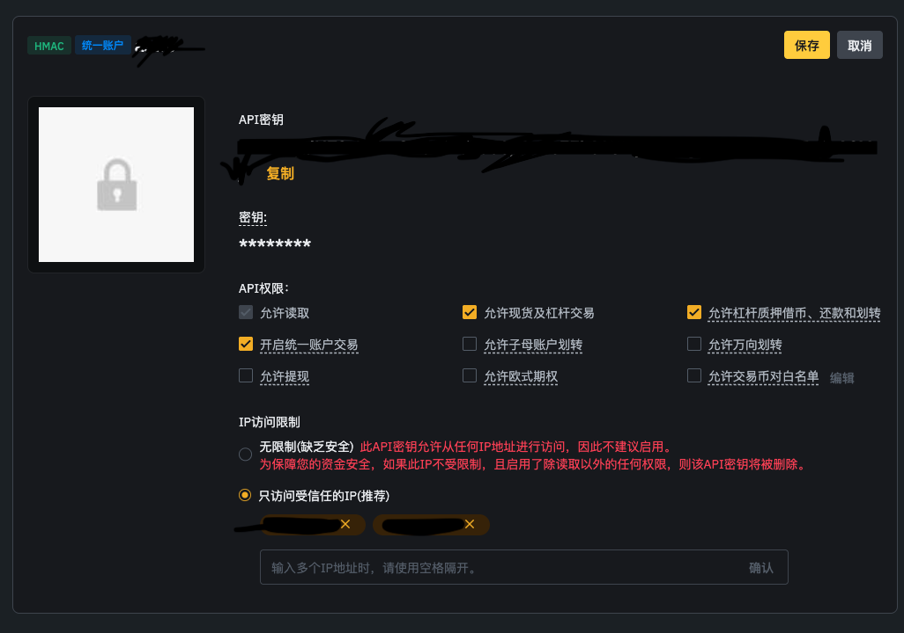
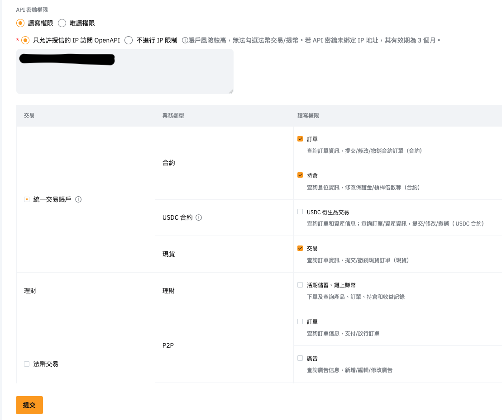
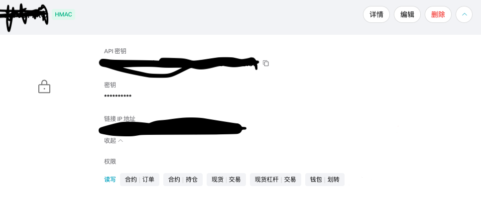
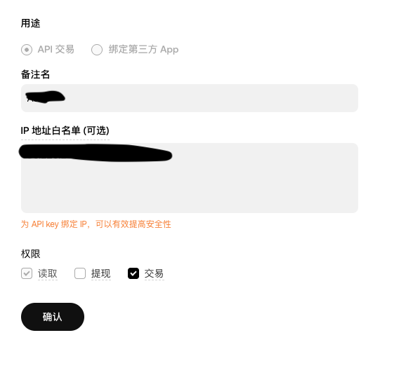
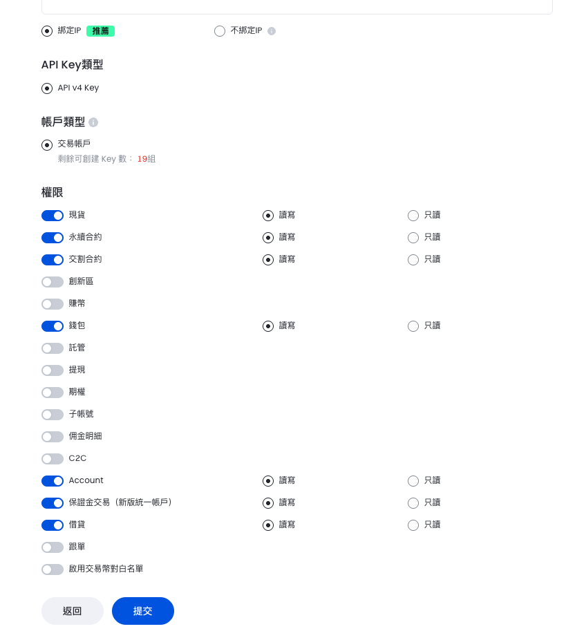
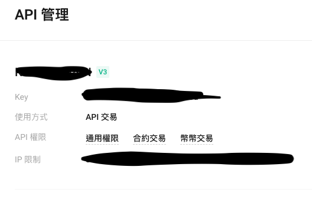

💰 支持的交易所 & 返佣比例：\
  •  Binance（币安）\
✅ 永久次月返现：现货30%，合约30%\
🎁 新人福利：注册后合约首月返佣提升到 40%！\
🔗 注册链接：\
https://www.binance.com/register?ref=HAOGEGE 

  •  OKX（欧易）\
✅ 永久次月返现：手续费30%\
🔗 注册链接：\
https://okx.com/join/48790398 \

  •  Bitget\
✅ 永久自动返现：手续费40%（注册后请提供 UID + 邮箱）\
🔗 注册链接：\
https://partner.bitget.com/bg/kk999 

•  Gate（芝麻开门）\
✅ 永久自动返现：手续费60%（注册后请提供 UID + 邮箱）\
🔗 注册链接：\
https://www.gateweb.xyz/share/YAYAGEGE

--- 正在与商务对接中 --\
Bybit: https://www.bybitglobal.com/invite?ref=YP9ANE0 \
Kucoin: https://www.kucoin.com/r/rf/YPXT4P3Q (必须外国身份， 例如帕劳ID， 不可以大陆身份证或护照) 


### [Astro产品介绍](./README.md) 
### [Astro安装教程](./INSTALL.md) 
### [Astro安全相关-必读](./SECURITY.md) 

套利策略，产品使用群 \
https://t.me/astro_discuss

行情工具 \
https://pulse.astro-btc.xyz/ \
https://astro-btc.github.io/Astro-Perps/?coin=ETH

实时资讯, 上新，费率调整等 \
https://t.me/astro_realtime_news

--------------------------------

# Astro - 安装教程

### 1. 云服务器要求
切记不可以使用中国境内服务器，推荐阿里云，亚马逊云香港，日本地区 \
**境外网络完全可以本地部署，交易所KEY需要绑定IP，请注意IP变化** 

操作系统: ```推荐Ubuntu系统``` \
系统架构：```x86-64``` \
内存：```最少2GB``` \

### 2. 执行一键安装脚本 (需确认公网IP地址)， 安装完成后请使用最新版Chrome浏览器打开（其他浏览器会有兼容性问题）
```
curl -L https://raw.githubusercontent.com/astro-btc/Astro/refs/heads/main/install-with-docker.sh | sudo bash -
```

### 3. astro-server/.env 文件字段说明

| **配置项**               | **说明**                                                        |
|--------------------------|-----------------------------------------------------------------|
| `PORT`                   | 端口号，需要防火墙放行此端口                                      |
| `ALLOWED_DOMAIN`         | 云服务公网IP地址，也可以填域名（填写域名需替换证书）                                      |
| `ADMIN_PREFIX`           | 管理后台访问的 URL 前缀 （请自行更改）                             |
| `ADMIN_SECURITY_CODE`    | 登录密码  （请自行更改）                                                      |
| `ADMIN_2FA_SECRET`       | 二次认证密钥，请导入 Google Authentication 使用 （请自行更改）    |


此配置文件修改过后，请重启系统生效 

### 4. 如何配置交易所API？
‼️ 请务必每一个api都添加IP地址白名单 ‼️  \
‼️ 请务必 **不要** 开通[提现]权限 ‼️ 

#### a. Binance
合约账户类型必须是 **统一账户**, 权限相关参考下图：\
（请先调整为统一账户，然后再创建API）


#### b. Bybit
保证金模式设置为： **全仓保证金** \
权限相关参考下图：\


#### c. Bitget
请使用联合保证金模式，权限相关参考下图：\


#### d. OKX
请使用跨币种保证金模式，权限相关参考下图：\


#### e. Gate
 ==> 请开启双向持仓(交易设置->交易配置->持仓模式选择双向持仓)  \
 ==> 请使用 **统一账户 + 跨币种保证金模式**，权限相关参考下图：\


#### f. Kucoin
权限相关参考下图：\


#### g. Aster
官网直接配置即可

#### h. Backpack🎒
https://backpack.exchange/portfolio/settings/api-keys
